# ZOODEX - Frontend

Esta es la **aplicación frontend de ZOODEX**, desarrollada con **Next.js**, diseñada para interactuar con la API de ZOODEX y ofrecer una experiencia de usuario **fluida, visual y estructurada** para la **exploración y gestión de un extenso catálogo de animales**.

ZOODEX es una plataforma informativa sobre animales, organizada por **categorías, subcategorías, tipos, dietas y rankings**, con herramientas avanzadas de navegación, búsqueda y administración.

⚠️ **Dependencia:** Esta aplicación consume la API de ZOODEX, por lo que requiere que el backend esté funcionando.

# 📸 Capturas de pantalla

<details>
<summary><strong>📂 Mostrar / Ocultar capturas</strong></summary>

<br>

### **INICIO**
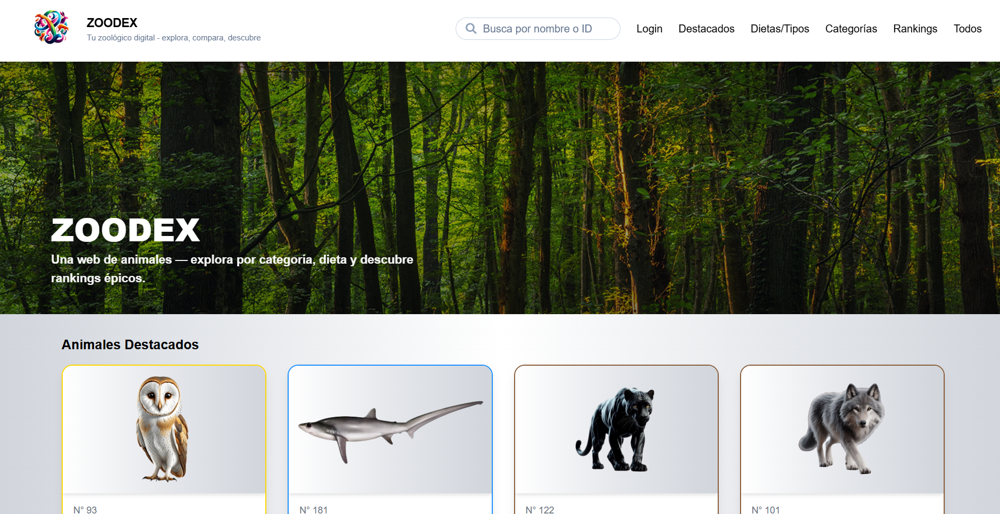

### **ANIMALES DESTACADOS**


### **EXPLORAR POR DIETA O TIPO**
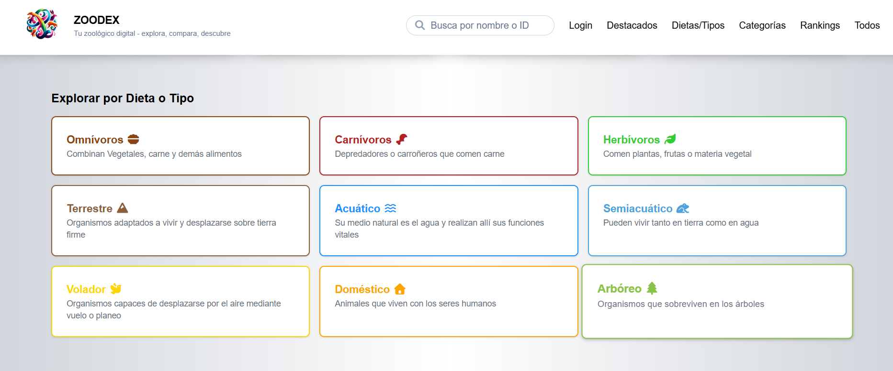

### **ANIMALES FILTRADOS POR TIPO**
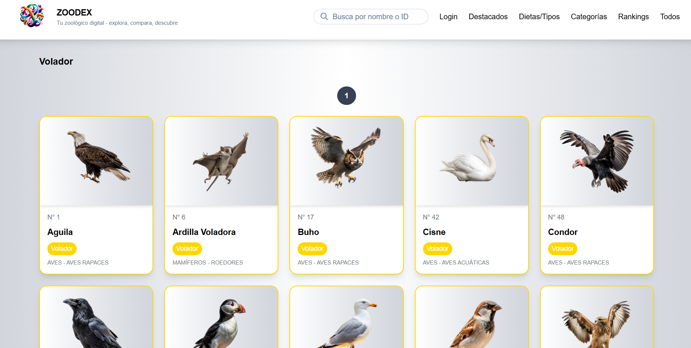

### **ANIMALES FILTRADOS POR DIETA**
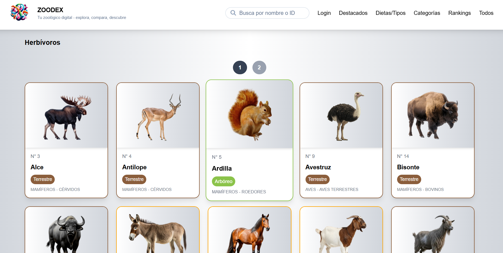

### **EXPLORAR POR CATEGORIA**
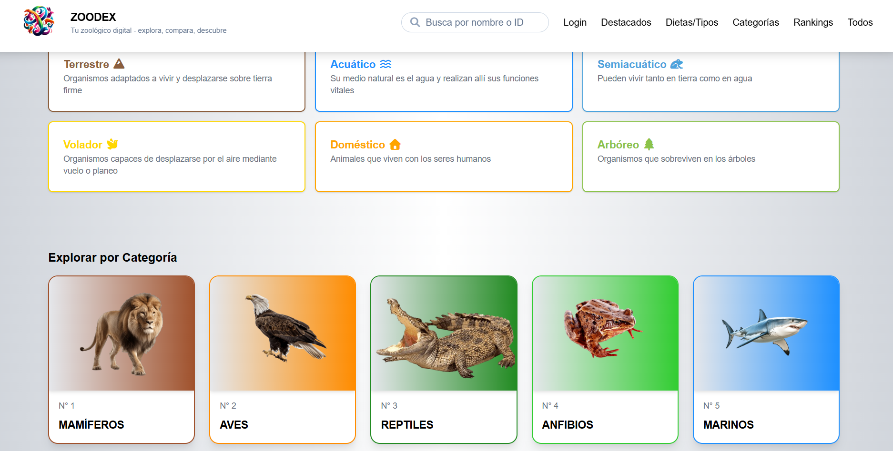

### **SUBCATEGORIAS**
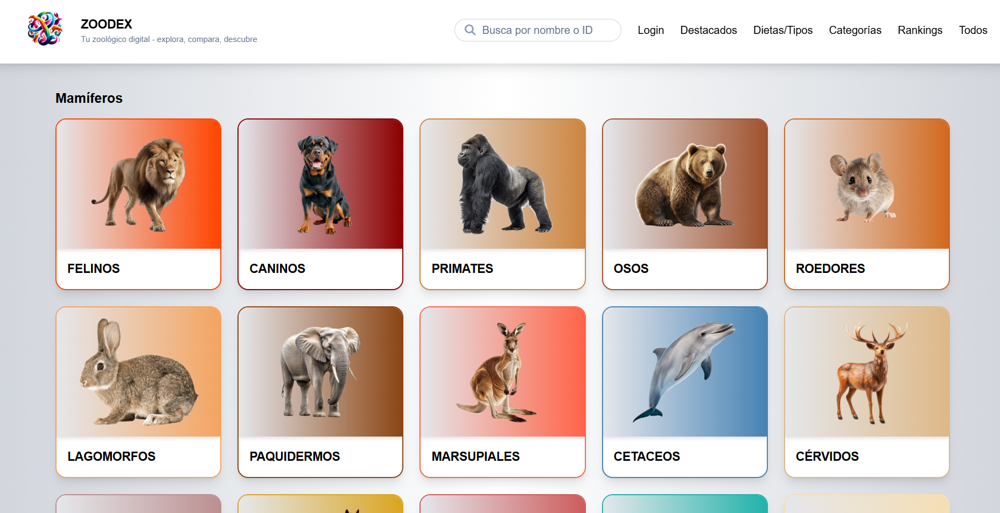

### **ANIMALES FILTRADOS POR SUBCATEGORIA**
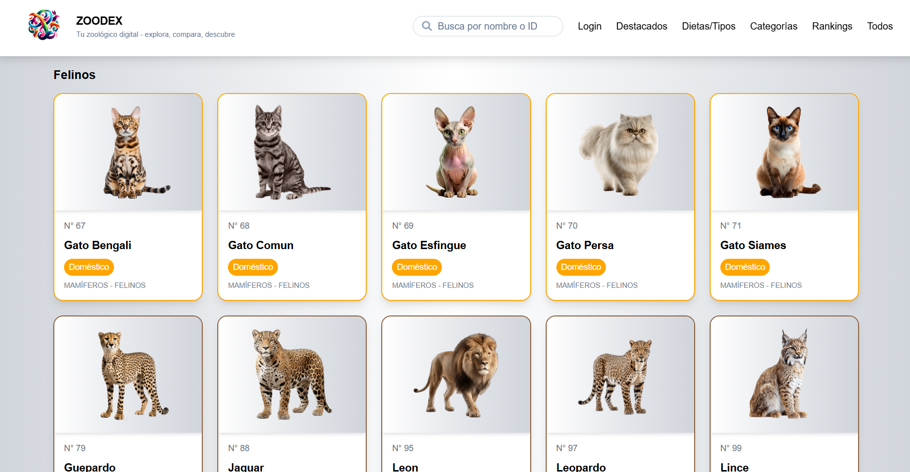

### **RANKINGS**
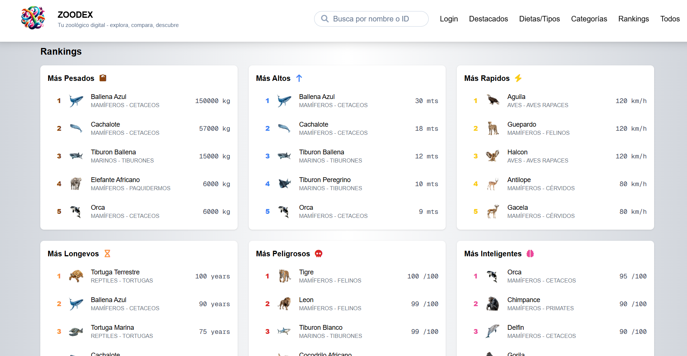

### **ANIMALES FILTRADOS POR RANKING**
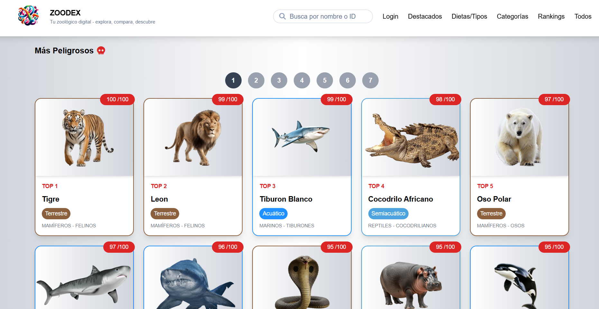

### **BUSCADOR DE ANIMALES**
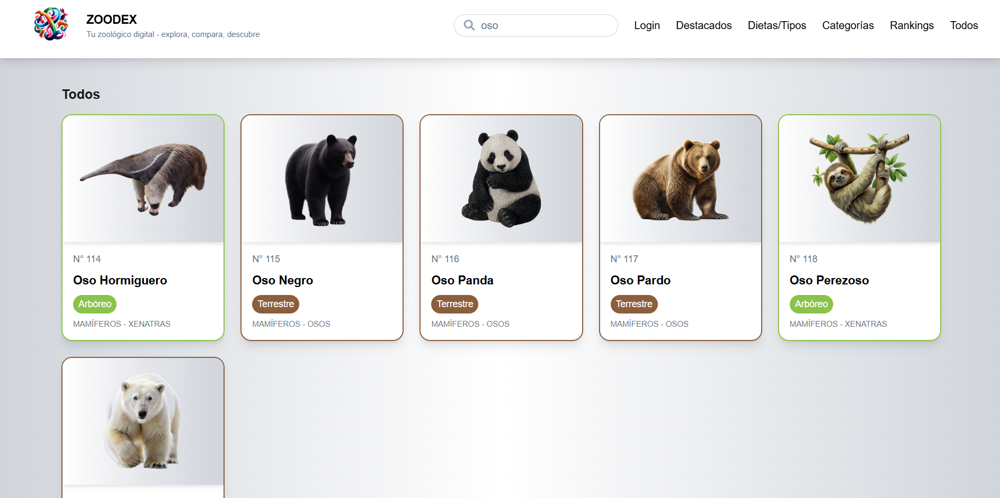

### **LOGIN ADMIN**
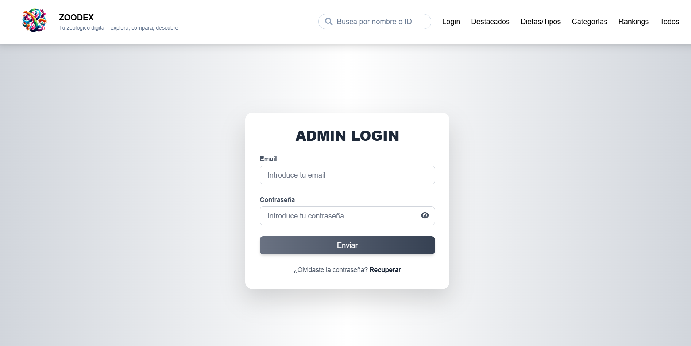

### **ADMIN EDITAR PERFIL**
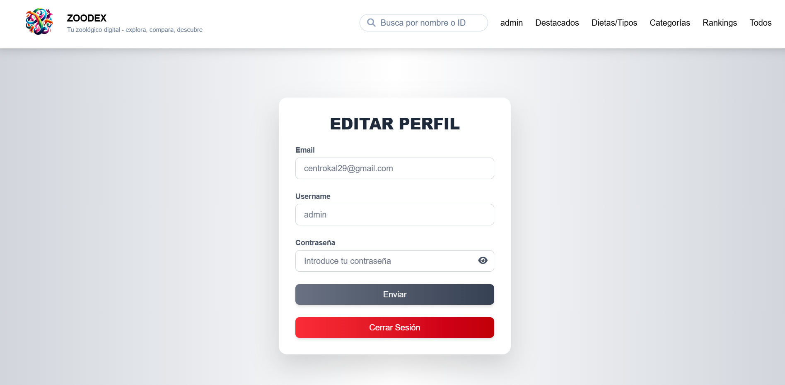

### **INFORMACION DEL ANIMAL**
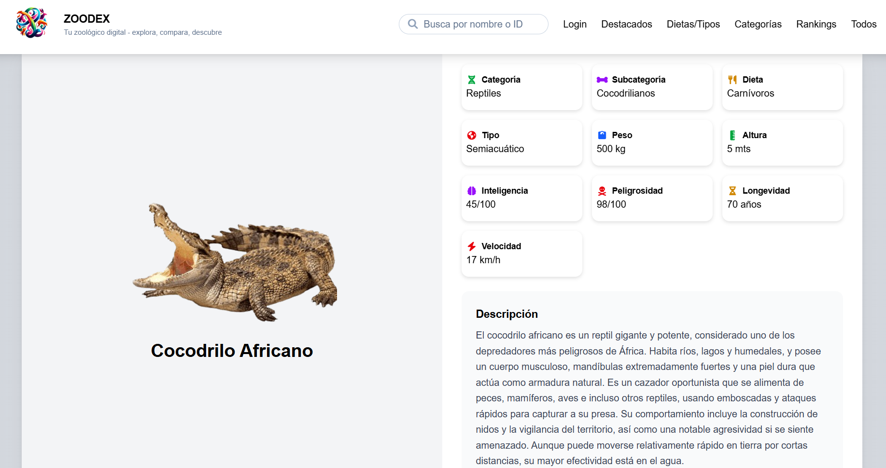

### **EDITAR ANIMAL**
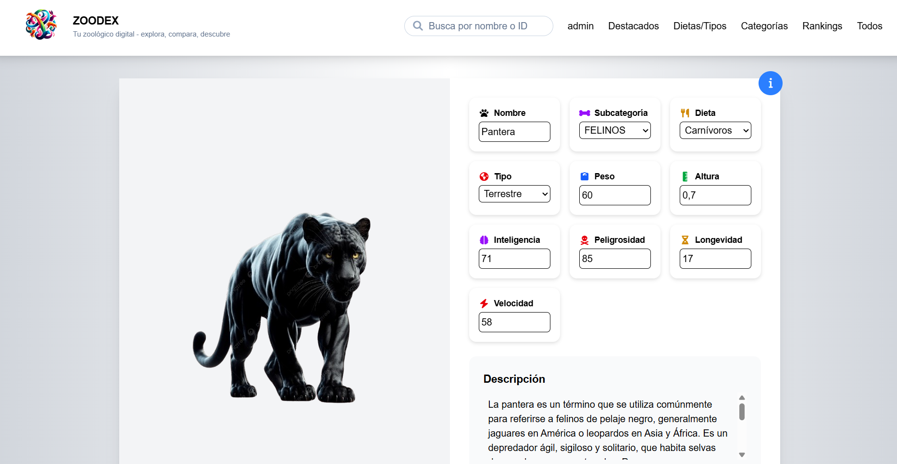


</details>

## Funcionalidades principales

### Navegación y exploración de animales
- Visualización de **animales destacados** en la página de inicio (selección aleatoria).
- Exploración del catálogo por:
  - **Categorías** (mamíferos, reptiles, anfibios, aves, marinos).
  - **Subcategorías** (felinos, caninos, tiburones, cocodrilianos, salmandras, peces, etc.).
  - **Tipo** (terrestre, volador, acuático, semiacuático, arbóreo, doméstico).
  - **Dieta** (carnívoros, herbívoros, omnívoros).
- Listados de animales con **paginación**.

### Detalle de animal
- Visualización completa de la ficha del animal:
  - Nombre.
  - Descripción.
  - Categoria, subcategoria, dieta, tipo.
  - Peso y altura.
  - Datos filtrables en rankings: Inteligencia, longevidad, peligrosidad y velocidad
- Navegación directa desde tarjetas a la página individual del animal.

### Rankings
- Rankings temáticos:
  - Más inteligentes.
  - Más altos.
  - Más pesados.
  - Más longevos.
  - Más peligrosos.
  - Más rápidos.
- Visualización inicial de los primeros animales del ranking.
- Acceso al listado completo del ranking.
- En cada tarjeta se muestra:
  - Posición en el ranking.
  - Valor asociado (kg, años, altura, etc.).

### Buscador
- Búsqueda de animales por:
  - Nombre.
  - ID.
- Resultados dinámicos con acceso directo a las fichas de los animales.

### Administración (Admin)
- Acceso restringido mediante login.
- **Edición total de animales**:
  - Modificación de todas sus propiedades.
  - Cambio de categoría, subcategoría, tipo y dieta.
  - Actualización de datos específicos según el animal.

### Consumo de API
- Uso de **fetch** para interactuar con la API.
- Manejo de respuestas y errores del servidor.
- Envío de cookies con `credentials: 'include'`.

### Routing y navegación
- Routing implementado con el sistema de rutas de **Next.js**.
- Navegación dinámica entre:
  - Categorías.
  - Subcategorías.
  - Rankings.
  - Animales individuales.
- Protección de rutas de administración.

### Notificaciones y feedback
- Feedback visual para acciones del usuario.
- Mensajes claros en errores de carga o búsqueda.
- Confirmaciones en acciones administrativas.

### Seguridad y buenas prácticas
- Protección de rutas privadas.
- Separación clara entre vistas públicas y administrativas.

### Variables de entorno
Crea un archivo `.env` en la raíz del proyecto y añade tus propios datos:

```bash
NEXT_PUBLIC_API_URL=
NEXT_PUBLIC_FRONTEND_URL=
```

## Tecnologías y Herramientas Utilizadas
- Next.js
- React
- Fetch API
- Sonner (notificaciones)
---

Este frontend está pensado para ser **consumido junto al backend de ZOODEX**, ofreciendo una interfaz completa y segura.


This is a [Next.js](https://nextjs.org) project bootstrapped with [`create-next-app`](https://nextjs.org/docs/app/api-reference/cli/create-next-app).

## Getting Started

First, run the development server:

```bash
npm run dev
# or
yarn dev
# or
pnpm dev
# or
bun dev
```

Open [http://localhost:3000](http://localhost:3000) with your browser to see the result.

You can start editing the page by modifying `app/page.tsx`. The page auto-updates as you edit the file.

This project uses [`next/font`](https://nextjs.org/docs/app/building-your-application/optimizing/fonts) to automatically optimize and load [Geist](https://vercel.com/font), a new font family for Vercel.

## Learn More

To learn more about Next.js, take a look at the following resources:

- [Next.js Documentation](https://nextjs.org/docs) - learn about Next.js features and API.
- [Learn Next.js](https://nextjs.org/learn) - an interactive Next.js tutorial.

You can check out [the Next.js GitHub repository](https://github.com/vercel/next.js) - your feedback and contributions are welcome!

## Deploy on Vercel

The easiest way to deploy your Next.js app is to use the [Vercel Platform](https://vercel.com/new?utm_medium=default-template&filter=next.js&utm_source=create-next-app&utm_campaign=create-next-app-readme) from the creators of Next.js.

Check out our [Next.js deployment documentation](https://nextjs.org/docs/app/building-your-application/deploying) for more details.
